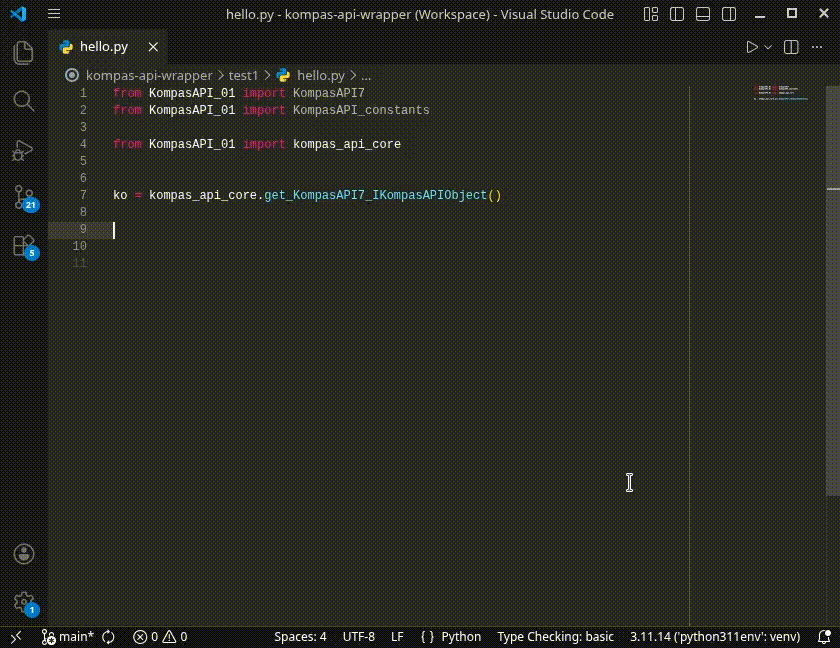

# KompasAPI-stubs-generator  <!-- omit in toc -->
Программа для создания stub-файлов с объявлениями классов, методов, свойств и аннотациями типов для Python-модулей API САПР «Компас-3D».


- [API Компас-3D для Python](#api-компас-3d-для-python)
- [Проблематика API Компас](#проблематика-api-компас)
- [Цель этого проекта](#цель-этого-проекта)
- [Состав программы](#состав-программы)
- [Особенности реализации](#особенности-реализации)
    - [Первоисточники — Python-модули, а не Справка](#первоисточники--python-модули-а-не-справка)
    - [Анализ оглавления Справки](#анализ-оглавления-справки)
    - [Анализ страниц Справки](#анализ-страниц-справки)
    - [Иерархия классов](#иерархия-классов)
- [Установка](#установка)
- [Запуск](#запуск)
    - [Создаваемые файлы](#создаваемые-файлы)


# API Компас-3D для Python

САПР «Компас-3D» предоставляет биндинги к своему API на языке Python.

Python-модули API — это сгенерированные файлы:
```
Kompas6API5.py
KompasAPI7.py
ksConstants.py
ksConstants3D.py
LDefin2D.py
LDefin3D.py
MiscellaneousHelpers.py
```
которые находятся в папке (путь может отличаться):
```
C:\ProgramData\ASCON\KOMPAS-3D\<версия>\Python 3\App\Lib\site-packages\pythonwin
```

API Компас описано в Справке SDK. Справка обычно есть в комплекте установки Компас-3D, но и [доступна онлайн](https://help.ascon.ru/KOMPAS_SDK/22/ru-RU/index.html) для версий v22 и выше.

# Проблематика API Компас

Python-модули Компас API содержат множество недостатков.

**Нет явно объявленных свойств у классов.** Названия свойств содержатся в виде строк в переменных `_prop_map_get_` и `_prop_map_put_` и поэтому никоем образом не могут быть обнаружены алгоритмом автодополнения среды разработки.

**Нет различий между свойствами и методами.** То, что в Справке называется свойством, в Python-модуле API может быть на самом деле методом, так как для получения значения этого «свойства» необходимо передать дополнительную информацию — в виде аргументов в методе: `The method is actually a property, but must be used as a method to correctly pass the arguments`.

**Нет иерархии классов.** В Справке SDK для API версии 7 указано, что классы интерфейсов наследуются и те свойства и методы, присущие своим родительским классам, в дочерних классах даже не описываются (что ожидаемо). Однако в Python-модулях все классы являются прямыми потомками лишь одного `win32com.client.DispatchBaseClass`, из-за чего некорректно работает функция `isinstance()` и в каждом классе перечислены все, включая родительские, свойства и методы.

**Лишние параметры в функциях.** Сигнатуры методов представлены с особенностями языка Си, в котором результат функции может записываться по указателю, переданному в функцию, а не через возвращаемое значение.

В Python-модулях API Компас все результирующие значения, если их несколько, возвращаются из функции в виде неизменяемого массива (tuple). Поэтому в сигнатурах некоторых функций параметры, которые в Си принимают указатель на переменную для результата, в Python бесполезны и не нужны (для них указывается значение по умолчанию `pythoncom.Missing`).

**Нет аннотаций типов.** В Python-модулях API аннотаций типов нет никаких, и поэтому не работают алгоритмы проверки типов и возникают сложности с автодополнением названий классов, свойств и методов.

<!-- Известно, что хорошей практикой при программировании на Python является активация проверки типов (type checking) и использование аннотаций типов (type hints) в своём коде. -->

<!--  -->

<details>
<summary>Можно частично активировать автодополнение некоторой полумерой...</summary>

Можно добиться работы автодополнения для методов (но не для свойств), если для каждого объекта указывать его тип вручную:
```python
app: KompasAPI7.IApplication = kompas_object.Application
docs: KompasAPI7.IDocuments = app.Documents
doc: KompasAPI7.IKompasDocument = docs.Add(...)
# ...
```
Однако это неудобно. Более того, в VSCode анализ Python-модулей API Компас очень ресурсоемкий, ощутимо долгий, так как модули содержат громоздкий код для обращений к API через механизмы Windows.
</details>

**Неинформативная документация.** В Python-модулях API к методам и классам (но не к свойствам) назначены строки документации (docstrings), но каждая буквально укладывается в 100 символов и лишь кратко описывает назначение класса/метода; при этом не указаны типы параметров и возвращаемых значений, способы получения объектов класса, возможность получения дополнительных интерфейсов и др.

Для получения дополнительных сведений приходится обращаться к полноценной Справке SDK Компас.

**Кодировка.** Кодировка Python-модулей API — это `cp1251`, а не `UTF-8`. Кодировка `cp1251` не всегда определяется автоматически в VSCode (необходимо явно открыть файл модуля API в отдельной вкладке IDE), и это приводит к тому, что невозможно прочитать и без того скудную документацию к методам и классам.

**Поиск в Справке неудобен.** При поиске в Справке SDK Компас результаты поиска ранжированы странным образом, и среди первых часто отображаются малоактуальные; невозможно выделить раздел для поиска (например, только API 7); в младших версиях Компас (v21 и ниже) поиск выполнялся только по словам целиком, а не их частям, что приводило к огромным неудобствам; поиск разделов по дереву оглавления Справки иногда затруднен, так как разделы помещены непредсказуемым образом (например, в разделе свойств помещены классы) и т. д.

# Цель этого проекта

Программа `KompasAPI_stubs_generator` нацелена на создание stub-файлов для модулей Компас API с использованием информации из Справки SDK Компас.

Stub-файлы имеют расширение `.pyi` и содержат не исполняемый код, а лишь объявления классов, их свойств и методов, аннотации типов свойств, параметров и возвращаемых значений функций. При этом в stub-файлах помещается почти в полном объеме документация из страниц Справки к соответствующим классам, методам, свойствам. Также используется информация об иерархии (наследовании) классов для сокращения перечня повторяющихся методов и свойств.

Благодаря stub-файлам работает проверка типов автодополнение названий, и доступно подробное описание:




# Состав программы

Программа `KompasAPI_stubs_generator` состоит из нескольких модулей, которые запускаются в следующем порядке:

1. `parse_module` выполняет анализ модулей `Kompas6API5.py` и `KompasAPI7.py`, сохраняет перечень классов, их свойств и методов.

2. `parse_table_of_contents` выполняет анализ оглавления Справки (файла `js/hmcontent.js`) и строит дерево ссылок на страницы.

3. `parse_topics` выполняет анализ заголовков и html-содержимого страниц Справки.

    В этом модуле формируются строки документации (docstrings) из текста страницы Справки. Извлекается информация об иерархии классов (о прямом родителе класса). Выполняется анализ типов данных свойств, параметров и возвращаемых значений методов.

    Для каждой страницы формируется и сохраняется:
    * название класса, метода, свойства или перечисления;
    * строка документации;
    * ссылка на страницу Справки;
    * тип страницы Справки;
    * информация об иерархии класса;
    * название класса, которому принадлежит метод или свойство;
    * ссылка на страницу класса, которому принадлежит метод или свойство;
    * ссылка на пример использования;
    * типы параметров и возвращаемого значения метода или тип данных свойства;
    * элементы перечисления;
    * заголовок статьи;
    * «хлебные крошки», то есть путь по разделам Справки к данной странице;

    В процессе анализа страниц активно используется модуль `parser_injections`, который содержит исправления («инъекции») и дополнительные указания об отклонениях от общего алгоритма анализа, как правило, из-за неточностей или ошибок в Справке Компас API.

 4. `update_module` обновляет записи о классах, методах, свойствах информацией из страниц Справки.

4. `generate_stub` формирует stub-файлы.

5. `generate_hierarchy` создает python-модуль, который хранит информацию о наследовании классов интерфейсов Компас API.

6. `generate_constants` создает python-модуль, в котором указаны константы и перечисления Компас API.


# Особенности реализации

## Первоисточники — Python-модули, а не Справка

Первоисточниками являются python-модули API Компас-3D: `KompasAPI7.py` и `Kompas6API5.py` — а не страницы Справки SDK. Дело в том, что:
* имеют место быть несовпадения наименований, например, `IMultiLine` (с заглавной `L`) в Справке вместо `IMultiline` в python-модулях;
* некоторые методы/свойства есть в справке, а в модулях нет; и наоборот;
* скрипт, проводящий парсинг справки, может не обнаружить соответствия тому, что есть в python-модулях, поэтому это останется в stub-файле, лишь будет незадокументированным.
<!-- * ; — но так лучше, потому что в действительности в скрипте макроса/библиотеки импортируется именно python-модуль API, а справка носит вторичный характер; -->

В коде программы все названия классов, методов, свойств используются приведенными к нижнему регистру для поиска и сопоставления названий.

Регистр символов названий в результирующих stub-файлах сохраняется таким же, какой представлен в исходных Python-модулях Компас API.


## Анализ оглавления Справки

Выделено два источника информации об оглавлении Справки:
* JavaScript-файл `js/hmcontent.js`;
* ссылки внутри абзацев `<p class="p_Z_LOC_TOC"> </p>` в html-содержимом страниц справки.

Выяснилось, что оглавление в файле `js/hmcontent.js` правильнее, чем ссылки в html-содержимом. Так, например, на странице у "Интерфейс ICircularCentres" неверна ссылка на страницу с методами; вместо неё — повторная ссылка на раздел со свойствами (props), но сама страница с методами есть и видны её подразделы (страницы на сами методы) в оглавлении в JavaScript-файле.

## Анализ страниц Справки

Страницы Справки представлены в виде:
* html-файлов в корневой папке Справки, например, `./ibody7.html`;
* js-файлов в папке `js`, например, `./js/ibody7.js`.

Названия файлов полностью соответствуют друг другу, лишь отличаются расширениями.

В этом проекте используются js-файлы страниц, потому что они более структурированы и не имеют «лишнего» контента (например, SVG-картинки, стили, скрипты и т.д., которые встроены в *каждый* html-файл).

## Иерархия классов

В результирующих stub-файлах даются указания о наследовании классов. Наследование классов применено для того, чтобы сократить количество повторяющихся методов и свойств.

Однако в действительности в модулях Компас-API классы не наследуются; они прямые потомки одного лишь класса `win32com.client.DispatchBaseClass`.

Стоит помнить, что функция `isinstance()` будет работать не так, как если бы было действительное наследование классов друг от друга.

<!-- Поэтому для проверки вместо `isinstance()` предназначена функция `isinstance_for_KompasAPI()`. -->

# Установка

Программа предназначена для работы на актуальной версии Python, который глобально установленном на компьютере (не требуется и не рекомендуется использовать Python, который поставляется вместе с Компас-3D).

Установить пакет с помощью команды:
```
pip install git+https://github.com/nikitamamay/KompasAPI-stubs-generator
```

> **Примечание.** При скачивании и установке пакета с GitHub через `pip` требуется, чтобы на компьютере был установлен [git](https://git-scm.com/install/windows).

Отсутствующие зависимости, включая пакеты `pywin32`, `bs4`, `lxml`, установятся автоматически.


Необходимые пререквизиты для работы программы:
* Python-модули API Компас-3D (любой версии) — модули будут найдены автоматически, если установлен Компас-3D;
    <!-- * или отдельные Python-модули API — [например, для версии v20](https://pypi.org/project/kompas3d/); -->
* Справка SDK для Компас v22 или старше, в web-формате (а не `.chm`), распакованная из zip-архива — обычно есть в комплекте установки Компас-3D, но и [доступна онлайн](https://help.ascon.ru/KOMPAS_SDK/22/ru-RU/index.html) (для версий v22 и выше).

Работоспособность проверена на Python 3.11, с использованием Компас-3D v22 учебной версии и Справки SDK Компас для версии v22.

# Запуск

Для запуска программы необходимо вызвать команду:
```
python -m KompasAPI_stubs_generator  <help_sdk_base_dir>
```
Аргументы командной строки:
* `help_sdk_base_dir` — путь к папке Справки SDK Компас, распакованной из zip-архива.


## Создаваемые файлы

Приложение в процессе работы создает файлы в папке `./output/` (по умолчанию).

Промежуточные файлы:

* `Kompas6API5_raw.json` и `KompasAPI7_raw.json` — файлы с описанием содержимого Python-модулей API Компас: классов, их свойств, методов;
* `toc.json` — проанализированное оглавление Справки SDK;
* `topics.json` — проанализированные страницы Справки;
* `Kompas6API5.json` и `KompasAPI7.json` — описание содержимого Python-модулей API, дополненное информацией из Справки и готовое к созданию результирующих файлов.

Результирующие файлы:

* `Kompas6API5.pyi` и `KompasAPI7.pyi` — stub-файлы для Python-модулей API;
* `classes_hierarchy.py` — Python-модуль с информацией о наследовании классов Компас API;
* `constants.py` — Python-модуль с константами и перечислениями Компас API.

